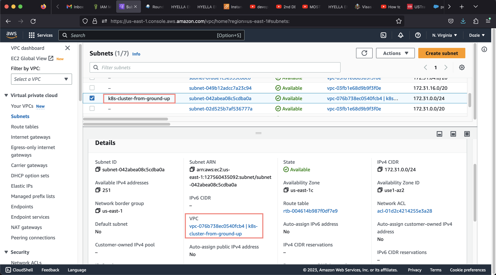
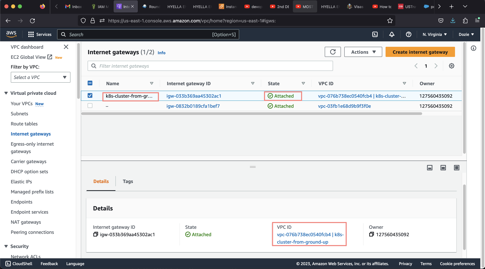
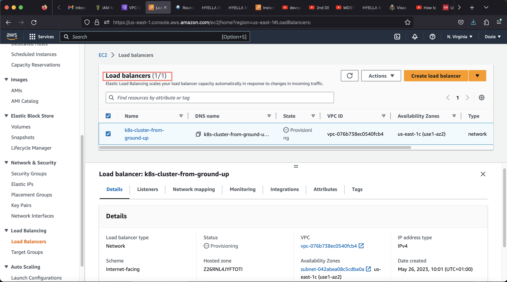
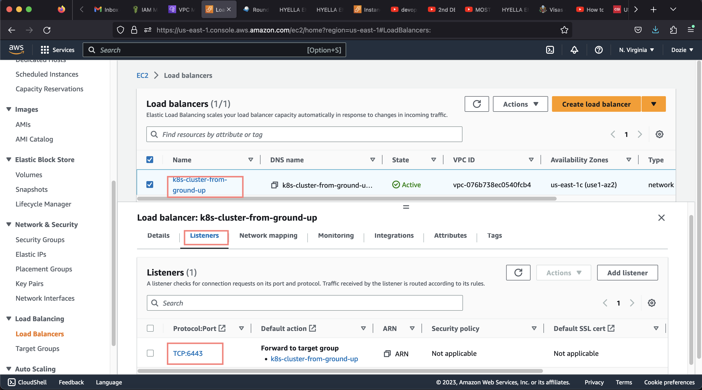
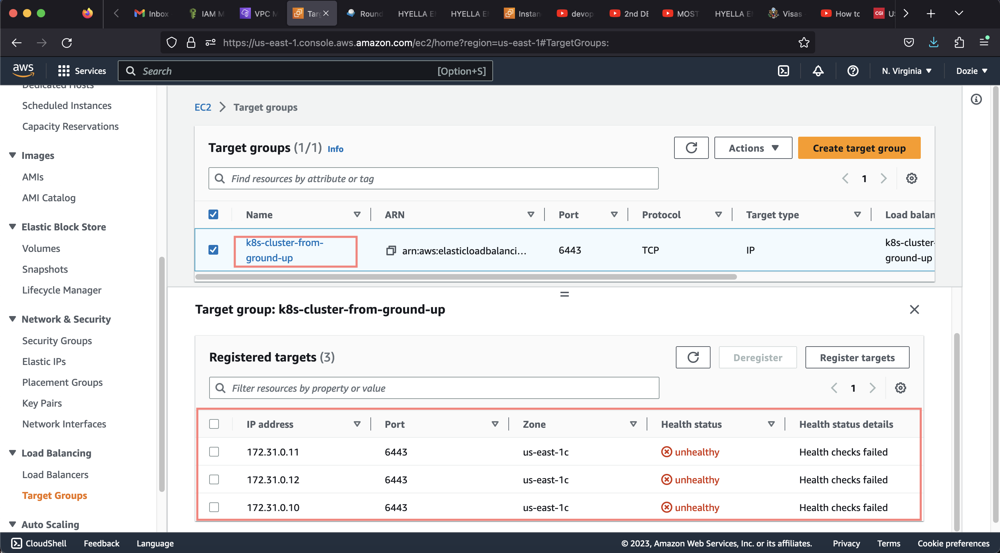

# **ORCHESTRATING CONTAINERS ACROSS MULTIPLE VIRTUAL SERVERS WITH KUBERNETES. PART 1**

# "Kubernetes From-Ground-Up"

### **K8s installation options**

To successfully implement "K8s From-Ground-Up", the following and even more will be done by you as a K8s administrator:

1. Install and configure master (also known as control plane) components and worker nodes (or just nodes).

2. Apply security settings across the entire cluster (i.e., encrypting the data in transit, and at rest)

    In transit encryption means encrypting communications over the network using HTTPS

    At rest encryption means encrypting the data stored on a disk

3.  Plan the capacity for the backend data store etcd

4. Configure network plugins for the containers to communicate

5. Manage periodical upgrade of the cluster

6. Configure observability and auditing

Note: Unless you have any business or compliance restrictions, ALWAYS consider to use managed versions of K8s – Platform as a Service offerings, such as Azure Kubernetes Service (AKS), Amazon Elastic Kubernetes Service (Amazon EKS), or Google Kubernetes Engine (GKE) as they usually have better default security settings, and the costs for maintaining the control plane are very low.


Let us begin building out Kubernetes cluster from the ground

DISCLAIMER: The following setup of Kubernetes should be used for learning purpose only, and not to be considered for production. This is because setting up a K8s cluster for production use has a lot more moving parts, especially when it comes to planning the nodes, and securing the cluster. The purpose of "K8s From-Ground-Up" is to get you much closer to the different components as shown in the architecture diagram and relate with what you have been learning about Kubernetes.

Tools to be used and expected result of the Project 20

1. VM: AWS EC2
2. OS: Ubuntu 20.04 lts+
3. Docker Engine
4. kubectl console utility
5. cfssl and cfssljson utilities
6. Kubernetes cluster

You will create 3 EC2 Instances, and in the end, we will have the following parts of the cluster properly configured:

- One Kubernetes Master
- Two Kubernetes Worker Nodes
- Configured SSL/TLS certificates for Kubernetes components to communicate securely
- Configured Node Network
- Configured Pod Network


# **STEP 0-INSTALL CLIENT TOOLS BEFORE BOOTSTRAPPING THE CLUSTER**

First, you will need some client tools installed and configurations made on your client workstation:

- awscli – is a unified tool to manage your AWS services

- kubectl – this command line utility will be your main control tool to manage your K8s cluster. You will use this tool so many times, so you will be able to type ‘kubetcl’ on your keyboard with a speed of light. You can always make a shortcut (alias) to just one character ‘k’. Also, add this extremely useful official kubectl Cheat Sheet to your bookmarks, it has examples of the most used ‘kubectl’ commands.

- cfssl – an open source toolkit for everything TLS/SSL from Cloudflare

- cfssljson – a program, which takes the JSON output from the cfssl and writes certificates, keys, CSRs, and bundles to disk.

## Install and configure AWS CLI

Configure AWS CLI to access all AWS services used, for this you need to have a user with programmatic access keys configured in AWS Identity and Access Management (IAM):


Test your AWS CLI by running:

`aws ec2 describe-vpcs`


## Installing kubectl

Kubernetes cluster has a Web API that can receive HTTP/HTTPS requests, but it is quite cumbersome to curl an API each and every time you need to send some command, so kubectl command tool was developed to ease a K8s administrator’s life.

With this tool you can easily interact with Kubernetes to deploy applications, inspect and manage cluster resources, view logs and perform many more administrative operations.


```
Download the binary

wget https://storage.googleapis.com/kubernetes-release/release/v1.21.0/bin/linux/amd64/kubectl

Make it executable

chmod +x kubectl
Move to the Bin directory

sudo mv kubectl /usr/local/bin/
Verify that kubectl version 1.21.0 or higher is installed:

kubectl version --client
```


## Install CFSSL and CFSSLJSON


cfssl is an open source tool by Cloudflare used to setup a Public Key Infrastructure (PKI Infrastructure) for generating, signing and bundling TLS certificates. In previous projects you have experienced the use of Letsencrypt for the similar use case. Here, cfssl will be configured as a Certificate Authority which will issue the certificates required to spin up a Kubernetes cluster.

```
wget -q --show-progress --https-only --timestamping \
  https://storage.googleapis.com/kubernetes-the-hard-way/cfssl/1.4.1/linux/cfssl \
  https://storage.googleapis.com/kubernetes-the-hard-way/cfssl/1.4.1/linux/cfssljson

chmod +x cfssl cfssljson

sudo mv cfssl cfssljson /usr/local/bin/
```


# AWS CLOUD RESOURCES FOR KUBERNETES CLUSTER

### Step 1 – Configure Network Infrastructure

Virtual Private Cloud – VPC

1. Create a directory named `k8s-cluster-from-ground-up`

2. Create a VPC and store the ID as a variable:
```
VPC_ID=$(aws ec2 create-vpc \
--cidr-block 172.31.0.0/16 \
--output text --query 'Vpc.VpcId'
)
```
3. Tag the VPC so that it is named:
```
NAME=k8s-cluster-from-ground-up

aws ec2 create-tags \
  --resources ${VPC_ID} \
  --tags Key=Name,Value=${NAME}
```
**Domain Name System – DNS**

4. Enable DNS support for your VPC:
```
aws ec2 modify-vpc-attribute \
--vpc-id ${VPC_ID} \
--enable-dns-support '{"Value": true}'
```
5. Enable DNS support for hostnames:

```
aws ec2 modify-vpc-attribute \
--vpc-id ${VPC_ID} \
--enable-dns-hostnames '{"Value": true}'
```


AWS Region

6. Set the required region
   
`AWS_REGION=us-east-1`

Dynamic Host Configuration Protocol – DHCP

7. Configure DHCP Options Set: 
```
DHCP_OPTION_SET_ID=$(aws ec2 create-dhcp-options \
  --dhcp-configuration \
    "Key=domain-name,Values=$AWS_REGION.compute.internal" \
    "Key=domain-name-servers,Values=AmazonProvidedDNS" \
  --output text --query 'DhcpOptions.DhcpOptionsId')
```


8. Tag the DHCP Option set:
```
aws ec2 create-tags \
  --resources ${DHCP_OPTION_SET_ID} \
  --tags Key=Name,Value=${NAME}
```

9. Associate the DHCP Option set with the VPC:
```
aws ec2 associate-dhcp-options \
  --dhcp-options-id ${DHCP_OPTION_SET_ID} \
  --vpc-id ${VPC_ID}
```


10. Create the Subnet:
```
SUBNET_ID=$(aws ec2 create-subnet \
  --vpc-id ${VPC_ID} \
  --cidr-block 172.31.0.0/24 \
  --output text --query 'Subnet.SubnetId')
```
```
aws ec2 create-tags \
  --resources ${SUBNET_ID} \
  --tags Key=Name,Value=${NAME}
```


Internet Gateway – IGW

11. Create the Internet Gateway and attach it to the VPC:
```
INTERNET_GATEWAY_ID=$(aws ec2 create-internet-gateway \
  --output text --query 'InternetGateway.InternetGatewayId')
aws ec2 create-tags \
  --resources ${INTERNET_GATEWAY_ID} \
  --tags Key=Name,Value=${NAME}
```
```
aws ec2 attach-internet-gateway \
  --internet-gateway-id ${INTERNET_GATEWAY_ID} \
  --vpc-id ${VPC_ID}
```

Route tables

12. Create route tables, associate the route table to subnet, and create a route to allow external traffic to the Internet through the Internet Gateway:

```
ROUTE_TABLE_ID=$(aws ec2 create-route-table \
  --vpc-id ${VPC_ID} \
  --output text --query 'RouteTable.RouteTableId')
aws ec2 create-tags \
  --resources ${ROUTE_TABLE_ID} \
  --tags Key=Name,Value=${NAME}
aws ec2 associate-route-table \
  --route-table-id ${ROUTE_TABLE_ID} \
  --subnet-id ${SUBNET_ID}
aws ec2 create-route \
  --route-table-id ${ROUTE_TABLE_ID} \
  --destination-cidr-block 0.0.0.0/0 \
  --gateway-id ${INTERNET_GATEWAY_ID}
```


## SECURITY GROUPS


13. Configure security groups
```
# Create the security group and store its ID in a variable
SECURITY_GROUP_ID=$(aws ec2 create-security-group \
  --group-name ${NAME} \
  --description "Kubernetes cluster security group" \
  --vpc-id ${VPC_ID} \
  --output text --query 'GroupId')

# Create the NAME tag for the security group
aws ec2 create-tags \
  --resources ${SECURITY_GROUP_ID} \
  --tags Key=Name,Value=${NAME}

# Create Inbound traffic for all communication within the subnet to connect on ports used by the master node(s)
aws ec2 authorize-security-group-ingress \
    --group-id ${SECURITY_GROUP_ID} \
    --ip-permissions IpProtocol=tcp,FromPort=2379,ToPort=2380,IpRanges='[{CidrIp=172.31.0.0/24}]'

# # Create Inbound traffic for all communication within the subnet to connect on ports used by the worker nodes
aws ec2 authorize-security-group-ingress \
    --group-id ${SECURITY_GROUP_ID} \
    --ip-permissions IpProtocol=tcp,FromPort=30000,ToPort=32767,IpRanges='[{CidrIp=172.31.0.0/24}]'

# Create inbound traffic to allow connections to the Kubernetes API Server listening on port 6443
aws ec2 authorize-security-group-ingress \
  --group-id ${SECURITY_GROUP_ID} \
  --protocol tcp \
  --port 6443 \
  --cidr 0.0.0.0/0

# Create Inbound traffic for SSH from anywhere (Do not do this in production. Limit access ONLY to IPs or CIDR that MUST connect)
aws ec2 authorize-security-group-ingress \
  --group-id ${SECURITY_GROUP_ID} \
  --protocol tcp \
  --port 22 \
  --cidr 0.0.0.0/0

# Create ICMP ingress for all types
aws ec2 authorize-security-group-ingress \
  --group-id ${SECURITY_GROUP_ID} \
  --protocol icmp \
  --port -1 \
  --cidr 0.0.0.0/0
```


## Network Load Balancer

14. Create a network Load balancer,
```
LOAD_BALANCER_ARN=$(aws elbv2 create-load-balancer \
--name ${NAME} \
--subnets ${SUBNET_ID} \
--scheme internet-facing \
--type network \
--output text --query 'LoadBalancers[].LoadBalancerArn')
```



## Tagret Group

15. Create a target group: (For now it will be unhealthy because there are no real targets yet.)
```
TARGET_GROUP_ARN=$(aws elbv2 create-target-group \
  --name ${NAME} \
  --protocol TCP \
  --port 6443 \
  --vpc-id ${VPC_ID} \
  --target-type ip \
  --output text --query 'TargetGroups[].TargetGroupArn')
```


16. Register targets: (Just like above, no real targets. You will just put the IP addresses so that, when the nodes become available, they will be used as targets.)
```
aws elbv2 register-targets \
  --target-group-arn ${TARGET_GROUP_ARN} \
  --targets Id=172.31.0.1{0,1,2}
```


17. Create a listener to listen for requests and forward to the target nodes on TCP port 6443
```
aws elbv2 create-listener \
--load-balancer-arn ${LOAD_BALANCER_ARN} \
--protocol TCP \
--port 6443 \
--default-actions Type=forward,TargetGroupArn=${TARGET_GROUP_ARN} \
--output text --query 'Listeners[].ListenerArn'
```



## Step 2 – Create Compute Resources
AMI

1. Get an image to create EC2 instances:
```
IMAGE_ID=$(aws ec2 describe-images --owners 099720109477 \
  --filters \
  'Name=root-device-type,Values=ebs' \
  'Name=architecture,Values=x86_64' \
  'Name=name,Values=ubuntu/images/hvm-ssd/ubuntu-xenial-16.04-amd64-server-*' \
  | jq -r '.Images|sort_by(.Name)[-1]|.ImageId')
```
SSH key-pair

2. Create SSH Key-Pair
```
mkdir -p ssh

aws ec2 create-key-pair \
  --key-name ${NAME} \
  --output text --query 'KeyMaterial' \
  > ssh/${NAME}.id_rsa
chmod 600 ssh/${NAME}.id_rsa
```
EC2 Instances for Controle Plane (Master Nodes)

Create 3 Master nodes: Note – Using t2.micro instead of t2.small as t2.micro is covered by AWS free tier
```
for i in 0 1 2; do
  instance_id=$(aws ec2 run-instances \
    --associate-public-ip-address \
    --image-id ${IMAGE_ID} \
    --count 1 \
    --key-name ${NAME} \
    --security-group-ids ${SECURITY_GROUP_ID} \
    --instance-type t2.micro \
    --private-ip-address 172.31.0.1${i} \
    --user-data "name=master-${i}" \
    --subnet-id ${SUBNET_ID} \
    --output text --query 'Instances[].InstanceId')
  aws ec2 modify-instance-attribute \
    --instance-id ${instance_id} \
    --no-source-dest-check
  aws ec2 create-tags \
    --resources ${instance_id} \
    --tags "Key=Name,Value=${NAME}-master-${i}"
done
```

## EC2 Instances for Worker Nodes

Create 3 worker nodes:
```
for i in 0 1 2; do
  instance_id=$(aws ec2 run-instances \
    --associate-public-ip-address \
    --image-id ${IMAGE_ID} \
    --count 1 \
    --key-name ${NAME} \
    --security-group-ids ${SECURITY_GROUP_ID} \
    --instance-type t2.micro \
    --private-ip-address 172.31.0.2${i} \
    --user-data "name=worker-${i}|pod-cidr=172.20.${i}.0/24" \
    --subnet-id ${SUBNET_ID} \
    --output text --query 'Instances[].InstanceId')
  aws ec2 modify-instance-attribute \
    --instance-id ${instance_id} \
    --no-source-dest-check
  aws ec2 create-tags \
    --resources ${instance_id} \
    --tags "Key=Name,Value=${NAME}-worker-${i}"
done
```

## Step 3 Prepare The Self-Signed Certificate Authority And Generate TLS Certificates

The PKI Infrastructure is provisioned using cfssl which will have a Certificate Authority which will then generate certificates for all the individual components:

- Creating a directory called ca-authority and cd into it:$ `mkdir ca-authority && cd ca-authority`
- Generating the CA configuration file, Root Certificate, and Private key:

```
{

cat > ca-config.json <<EOF
{
  "signing": {
    "default": {
      "expiry": "8760h"
    },
    "profiles": {
      "kubernetes": {
        "usages": ["signing", "key encipherment", "server auth", "client auth"],
        "expiry": "8760h"
      }
    }
  }
}
EOF

cat > ca-csr.json <<EOF
{
  "CN": "Kubernetes",
  "key": {
    "algo": "rsa",
    "size": 2048
  },
  "names": [
    {
      "C": "UK",
      "L": "England",
      "O": "Kubernetes",
      "OU": "DAREY.IO DEVOPS",
      "ST": "London"
    }
  ]
}
EOF

cfssl gencert -initca ca-csr.json | cfssljson -bare ca

}
```

### Generating TLS Certificates For Client and Server

The certificate for the Api-server must have IP addresses, DNS names, and a Load Balancer address included. Otherwise, you will have a lot of difficulties connecting to the api-server.

1. Generate the Certificate Signing Request (CSR), Private Key and the Certificate for the Kubernetes Master Nodes.

```
{
cat > master-kubernetes-csr.json <<EOF
{
  "CN": "kubernetes",
   "hosts": [
   "127.0.0.1",
   "172.31.0.10",
   "172.31.0.11",
   "172.31.0.12",
   "ip-172-31-0-10",
   "ip-172-31-0-11",
   "ip-172-31-0-12",
   "ip-172-31-0-10.${AWS_REGION}.compute.internal",
   "ip-172-31-0-11.${AWS_REGION}.compute.internal",
   "ip-172-31-0-12.${AWS_REGION}.compute.internal",
   "${KUBERNETES_PUBLIC_ADDRESS}",
   "kubernetes",
   "kubernetes.default",
   "kubernetes.default.svc",
   "kubernetes.default.svc.cluster",
   "kubernetes.default.svc.cluster.local"
  ],
  "key": {
    "algo": "rsa",
    "size": 2048
  },
  "names": [
    {
      "C": "UK",
      "L": "England",
      "O": "Kubernetes",
      "OU": "DAREY.IO DEVOPS",
      "ST": "London"
    }
  ]
}
EOF

cfssl gencert \
  -ca=ca.pem \
  -ca-key=ca-key.pem \
  -config=ca-config.json \
  -profile=kubernetes \
  master-kubernetes-csr.json | cfssljson -bare master-kubernetes
}
```

2. kube-scheduler Client Certificate and Private Key

```
{

cat > kube-scheduler-csr.json <<EOF
{
  "CN": "system:kube-scheduler",
  "key": {
    "algo": "rsa",
    "size": 2048
  },
  "names": [
    {
      "C": "UK",
      "L": "England",
      "O": "system:kube-scheduler",
      "OU": "DAREY.IO DEVOPS",
      "ST": "London"
    }
  ]
}
EOF

cfssl gencert \
  -ca=ca.pem \
  -ca-key=ca-key.pem \
  -config=ca-config.json \
  -profile=kubernetes \
  kube-scheduler-csr.json | cfssljson -bare kube-scheduler

}
```

3. kube-proxy Client Certificate and Private Key

```
{

cat > kube-proxy-csr.json <<EOF
{
  "CN": "system:kube-proxy",
  "key": {
    "algo": "rsa",
    "size": 2048
  },
  "names": [
    {
      "C": "UK",
      "L": "England",
      "O": "system:node-proxier",
      "OU": "DAREY.IO DEVOPS",
      "ST": "London"
    }
  ]
}
EOF

cfssl gencert \
  -ca=ca.pem \
  -ca-key=ca-key.pem \
  -config=ca-config.json \
  -profile=kubernetes \
  kube-proxy-csr.json | cfssljson -bare kube-proxy

}
```

4. kube-controller-manager Client Certificate and Private Key
```
{
cat > kube-controller-manager-csr.json <<EOF
{
  "CN": "system:kube-controller-manager",
  "key": {
    "algo": "rsa",
    "size": 2048
  },
  "names": [
    {
      "C": "UK",
      "L": "England",
      "O": "system:kube-controller-manager",
      "OU": "DAREY.IO DEVOPS",
      "ST": "London"
    }
  ]
}
EOF

cfssl gencert \
  -ca=ca.pem \
  -ca-key=ca-key.pem \
  -config=ca-config.json \
  -profile=kubernetes \
  kube-controller-manager-csr.json | cfssljson -bare kube-controller-manager

}
```

5. kubelet Client Certificate and Private Key

```
for i in 0 1 2; do
  instance="${NAME}-worker-${i}"
  instance_hostname="ip-172-31-0-2${i}"
  cat > ${instance}-csr.json <<EOF
{
  "CN": "system:node:${instance_hostname}",
  "key": {
    "algo": "rsa",
    "size": 2048
  },
  "names": [
    {
      "C": "UK",
      "L": "England",
      "O": "system:nodes",
      "OU": "DAREY.IO DEVOPS",
      "ST": "London"
    }
  ]
}
EOF

  external_ip=$(aws ec2 describe-instances \
    --filters "Name=tag:Name,Values=${instance}" \
    --output text --query 'Reservations[].Instances[].PublicIpAddress')

  internal_ip=$(aws ec2 describe-instances \
    --filters "Name=tag:Name,Values=${instance}" \
    --output text --query 'Reservations[].Instances[].PrivateIpAddress')

  cfssl gencert \
    -ca=ca.pem \
    -ca-key=ca-key.pem \
    -config=ca-config.json \
    -hostname=${instance_hostname},${external_ip},${internal_ip} \
    -profile=kubernetes \
    ${NAME}-worker-${i}-csr.json | cfssljson -bare ${NAME}-worker-${i}
done
```


6. Finally, kubernetes admin user's Client Certificate and Private Key

```
{
cat > admin-csr.json <<EOF
{
  "CN": "admin",
  "key": {
    "algo": "rsa",
    "size": 2048
  },
  "names": [
    {
      "C": "UK",
      "L": "England",
      "O": "system:masters",
      "OU": "DAREY.IO DEVOPS",
      "ST": "London"
    }
  ]
}
EOF

cfssl gencert \
  -ca=ca.pem \
  -ca-key=ca-key.pem \
  -config=ca-config.json \
  -profile=kubernetes \
  admin-csr.json | cfssljson -bare admin
}
```


7. Token Controller

```
{

cat > service-account-csr.json <<EOF
{
  "CN": "service-accounts",
  "key": {
    "algo": "rsa",
    "size": 2048
  },
  "names": [
    {
      "C": "UK",
      "L": "England",
      "O": "Kubernetes",
      "OU": "DAREY.IO DEVOPS",
      "ST": "London"
    }
  ]
}
EOF

cfssl gencert \
  -ca=ca.pem \
  -ca-key=ca-key.pem \
  -config=ca-config.json \
  -profile=kubernetes \
  service-account-csr.json | cfssljson -bare service-account
}
```

## Step 4 – Distributing the Client and Server Certificates

Now it is time to start sending all the client and server certificates to their respective instances.

Let us begin with the **worker nodes**:

Copy these files securely to the worker nodes using scp utility

- Root CA certificate – ca.pem
- X509 Certificate for each worker node
- Private Key of the certificate for each worker node

```
for i in 0 1 2; do
  instance="${NAME}-worker-${i}"
  external_ip=$(aws ec2 describe-instances \
    --filters "Name=tag:Name,Values=${instance}" \
    --output text --query 'Reservations[].Instances[].PublicIpAddress')
  scp -i ../ssh/${NAME}.id_rsa \
    ca.pem ${instance}-key.pem ${instance}.pem ubuntu@${external_ip}:~/; \
done
```

**Master or Controller node**: – Note that only the api-server related files will be sent over to the master nodes.
```
for i in 0 1 2; do
instance="${NAME}-master-${i}" \
  external_ip=$(aws ec2 describe-instances \
    --filters "Name=tag:Name,Values=${instance}" \
    --output text --query 'Reservations[].Instances[].PublicIpAddress')
  scp -i ../ssh/${NAME}.id_rsa \
    ca.pem ca-key.pem service-account-key.pem service-account.pem \
    master-kubernetes.pem master-kubernetes-key.pem ubuntu@${external_ip}:~/;
done
```


## STEP 5 USE `KUBECTL` TO GENERATE KUBERNETES CONFIGURATION FILES FOR AUTHENTICATION

First, let us create a few environment variables for reuse by multiple commands.
```
KUBERNETES_API_SERVER_ADDRESS=$(aws elbv2 describe-load-balancers --load-balancer-arns ${LOAD_BALANCER_ARN} --output text --query 'LoadBalancers[].DNSName')
```

1. Generate the kubelet kubeconfig file

```
for i in 0 1 2; do

instance="${NAME}-worker-${i}"
instance_hostname="ip-172-31-0-2${i}"

 # Set the kubernetes cluster in the kubeconfig file
  kubectl config set-cluster ${NAME} \
    --certificate-authority=ca.pem \
    --embed-certs=true \
    --server=https://$KUBERNETES_API_SERVER_ADDRESS:6443 \
    --kubeconfig=${instance}.kubeconfig

# Set the cluster credentials in the kubeconfig file
  kubectl config set-credentials system:node:${instance_hostname} \
    --client-certificate=${instance}.pem \
    --client-key=${instance}-key.pem \
    --embed-certs=true \
    --kubeconfig=${instance}.kubeconfig

# Set the context in the kubeconfig file
  kubectl config set-context default \
    --cluster=${NAME} \
    --user=system:node:${instance_hostname} \
    --kubeconfig=${instance}.kubeconfig

  kubectl config use-context default --kubeconfig=${instance}.kubeconfig
done
```

2. Generate the kube-proxy kubeconfig

```
{
  kubectl config set-cluster ${NAME} \
    --certificate-authority=ca.pem \
    --embed-certs=true \
    --server=https://${KUBERNETES_API_SERVER_ADDRESS}:6443 \
    --kubeconfig=kube-proxy.kubeconfig

  kubectl config set-credentials system:kube-proxy \
    --client-certificate=kube-proxy.pem \
    --client-key=kube-proxy-key.pem \
    --embed-certs=true \
    --kubeconfig=kube-proxy.kubeconfig

  kubectl config set-context default \
    --cluster=${NAME} \
    --user=system:kube-proxy \
    --kubeconfig=kube-proxy.kubeconfig

  kubectl config use-context default --kubeconfig=kube-proxy.kubeconfig
}
```

3. Generate the Kube-Controller-Manager kubeconfig

```
{
  kubectl config set-cluster ${NAME} \
    --certificate-authority=ca.pem \
    --embed-certs=true \
    --server=https://127.0.0.1:6443 \
    --kubeconfig=kube-controller-manager.kubeconfig

  kubectl config set-credentials system:kube-controller-manager \
    --client-certificate=kube-controller-manager.pem \
    --client-key=kube-controller-manager-key.pem \
    --embed-certs=true \
    --kubeconfig=kube-controller-manager.kubeconfig

  kubectl config set-context default \
    --cluster=${NAME} \
    --user=system:kube-controller-manager \
    --kubeconfig=kube-controller-manager.kubeconfig

  kubectl config use-context default --kubeconfig=kube-controller-manager.kubeconfig
}
```


4. Generating the Kube-Scheduler Kubeconfig

```
{
  kubectl config set-cluster ${NAME} \
    --certificate-authority=ca.pem \
    --embed-certs=true \
    --server=https://127.0.0.1:6443 \
    --kubeconfig=kube-scheduler.kubeconfig

  kubectl config set-credentials system:kube-scheduler \
    --client-certificate=kube-scheduler.pem \
    --client-key=kube-scheduler-key.pem \
    --embed-certs=true \
    --kubeconfig=kube-scheduler.kubeconfig

  kubectl config set-context default \
    --cluster=${NAME} \
    --user=system:kube-scheduler \
    --kubeconfig=kube-scheduler.kubeconfig

  kubectl config use-context default --kubeconfig=kube-scheduler.kubeconfig
}
```

5. Finally, generate the kubeconfig file for the admin user

```
{
  kubectl config set-cluster ${NAME} \
    --certificate-authority=ca.pem \
    --embed-certs=true \
    --server=https://${KUBERNETES_API_SERVER_ADDRESS}:6443 \
    --kubeconfig=admin.kubeconfig

  kubectl config set-credentials admin \
    --client-certificate=admin.pem \
    --client-key=admin-key.pem \
    --embed-certs=true \
    --kubeconfig=admin.kubeconfig

  kubectl config set-context default \
    --cluster=${NAME} \
    --user=admin \
    --kubeconfig=admin.kubeconfig

  kubectl config use-context default --kubeconfig=admin.kubeconfig
}
```

### ***Note: Distribute the files to their respective servers, using `scp` and a for loop like we have done previously. This is a test to validate that you understand which component must go to which node.***


## Step 6 Prepare the etcd database for encryption at rest.

Kubernetes uses etcd (A distributed key value store) to store variety of data which includes the cluster state, application configurations, and secrets. By default, the data that is being persisted to the disk is not encrypted. Any attacker that is able to gain access to this database can exploit the cluster since the data is stored in plain text. Hence, it is a security risk for Kubernetes that needs to be addressed.

- Generate the encryption key and encode it using base64

`ETCD_ENCRYPTION_KEY=$(head -c 32 /dev/urandom | base64)`

** Create an encryption-config.yaml file as documented officially by kubernetes
```
cat > encryption-config.yaml <<EOF
kind: EncryptionConfig
apiVersion: v1
resources:
  - resources:
      - secrets
    providers:
      - aescbc:
          keys:
            - name: key1
              secret: ${ETCD_ENCRYPTION_KEY}
      - identity: {}
EOF
```

**Send the encryption file to the Controller nodes using scp and a for loop.**

## Bootstrap etcd cluster

1. SSH into the controller server

Master-1
```
master_1_ip=$(aws ec2 describe-instances \
--filters "Name=tag:Name,Values=${NAME}-master-0" \
--output text --query 'Reservations[].Instances[].PublicIpAddress')
ssh -i k8s-cluster-from-ground-up.id_rsa ubuntu@${master_1_ip}
```
Master-2
```
master_2_ip=$(aws ec2 describe-instances \
--filters "Name=tag:Name,Values=${NAME}-master-1" \
--output text --query 'Reservations[].Instances[].PublicIpAddress')
ssh -i k8s-cluster-from-ground-up.id_rsa ubuntu@${master_2_ip}
```
Master-3
```
master_3_ip=$(aws ec2 describe-instances \
--filters "Name=tag:Name,Values=${NAME}-master-2" \
--output text --query 'Reservations[].Instances[].PublicIpAddress')
ssh -i k8s-cluster-from-ground-up.id_rsa ubuntu@${master_3_ip}
```
You should have a a similar pane like below. You should be able to see all the files that have been sent to the nodes.


2. Download and install etcd
```
  wget -q --show-progress --https-only --timestamping \
  "https://github.com/etcd-io/etcd/releases/download/v3.4.15/etcd-v3.4.15-linux-amd64.tar.gz"
```
3. Extract and install the etcd server and the etcdctl command line utility:
```
{
tar -xvf etcd-v3.4.15-linux-amd64.tar.gz
sudo mv etcd-v3.4.15-linux-amd64/etcd* /usr/local/bin/
}
```
4. Configure the etcd server
```
{
  sudo mkdir -p /etc/etcd /var/lib/etcd
  sudo chmod 700 /var/lib/etcd
  sudo cp ca.pem master-kubernetes-key.pem master-kubernetes.pem /etc/etcd/
}
```
5. The instance internal IP address will be used to serve client requests and communicate with etcd cluster peers. Retrieve the internal IP address for the current compute instance:
```
export INTERNAL_IP=$(curl -s http://169.254.169.254/latest/meta-data/local-ipv4)
```
6. Each etcd member must have a unique name within an etcd cluster. Set the etcd name to node Private IP address so it will uniquely identify the machine:
```
ETCD_NAME=$(curl -s http://169.254.169.254/latest/user-data/ \
  | tr "|" "\n" | grep "^name" | cut -d"=" -f2)

echo ${ETCD_NAME}
```
7. Create the etcd.service systemd unit file:
The flags are well documented here
```
cat <<EOF | sudo tee /etc/systemd/system/etcd.service
[Unit]
Description=etcd
Documentation=https://github.com/coreos

[Service]
Type=notify
ExecStart=/usr/local/bin/etcd \\
  --name ${ETCD_NAME} \\
  --trusted-ca-file=/etc/etcd/ca.pem \\
  --peer-trusted-ca-file=/etc/etcd/ca.pem \\
  --peer-client-cert-auth \\
  --client-cert-auth \\
  --listen-peer-urls https://${INTERNAL_IP}:2380 \\
  --listen-client-urls https://${INTERNAL_IP}:2379,https://127.0.0.1:2379 \\
  --advertise-client-urls https://${INTERNAL_IP}:2379 \\
  --initial-cluster-token etcd-cluster-0 \\
  --initial-cluster master-0=https://172.31.0.10:2380,master-1=https://172.31.0.11:2380,master-2=https://172.31.0.12:2380 \\
  --cert-file=/etc/etcd/master-kubernetes.pem \\
  --key-file=/etc/etcd/master-kubernetes-key.pem \\
  --peer-cert-file=/etc/etcd/master-kubernetes.pem \\
  --peer-key-file=/etc/etcd/master-kubernetes-key.pem \\
  --initial-advertise-peer-urls https://${INTERNAL_IP}:2380 \\
  --initial-cluster-state new \\
  --data-dir=/var/lib/etcd
Restart=on-failure
RestartSec=5

[Install]
WantedBy=multi-user.target
EOF
```

8. Start and enable the etcd Server
```
{
sudo systemctl daemon-reload
sudo systemctl enable etcd
sudo systemctl start etcd
}
```
9. Verify the etcd installation
```
sudo ETCDCTL_API=3 etcdctl member list \
  --endpoints=https://127.0.0.1:2379 \
  --cacert=/etc/etcd/ca.pem \
  --cert=/etc/etcd/master-kubernetes.pem \
  --key=/etc/etcd/master-kubernetes-key.pem
```


## BOOTSTRAP THE CONTROL PLANE

1. Create the Kubernetes configuration directory:

`sudo mkdir -p /etc/kubernetes/config`

2. Download the official Kubernetes release binaries:
```
wget -q --show-progress --https-only --timestamping \
"https://storage.googleapis.com/kubernetes-release/release/v1.21.0/bin/linux/amd64/kube-apiserver" \
"https://storage.googleapis.com/kubernetes-release/release/v1.21.0/bin/linux/amd64/kube-controller-manager" \
"https://storage.googleapis.com/kubernetes-release/release/v1.21.0/bin/linux/amd64/kube-scheduler" \
"https://storage.googleapis.com/kubernetes-release/release/v1.21.0/bin/linux/amd64/kubectl"
```
3. Install the Kubernetes binaries:
```
{
chmod +x kube-apiserver kube-controller-manager kube-scheduler kubectl
sudo mv kube-apiserver kube-controller-manager kube-scheduler kubectl /usr/local/bin/
}
```
4. Configure the Kubernetes API Server:
```
{
sudo mkdir -p /var/lib/kubernetes/

sudo mv ca.pem ca-key.pem master-kubernetes-key.pem master-kubernetes.pem \
service-account-key.pem service-account.pem \
encryption-config.yaml /var/lib/kubernetes/
}
```
The instance internal IP address will be used to advertise the API Server to members of the cluster. Retrieve the internal IP address for the current compute instance:

`export INTERNAL_IP=$(curl -s http://169.254.169.254/latest/meta-data/local-ipv4)`

Create the kube-apiserver.service systemd unit file: 

```
cat <<EOF | sudo tee /etc/systemd/system/kube-apiserver.service
[Unit]
Description=Kubernetes API Server
Documentation=https://github.com/kubernetes/kubernetes

[Service]
ExecStart=/usr/local/bin/kube-apiserver \\
  --advertise-address=${INTERNAL_IP} \\
  --allow-privileged=true \\
  --apiserver-count=3 \\
  --audit-log-maxage=30 \\
  --audit-log-maxbackup=3 \\
  --audit-log-maxsize=100 \\
  --audit-log-path=/var/log/audit.log \\
  --authorization-mode=Node,RBAC \\
  --bind-address=0.0.0.0 \\
  --client-ca-file=/var/lib/kubernetes/ca.pem \\
  --enable-admission-plugins=NamespaceLifecycle,NodeRestriction,LimitRanger,ServiceAccount,DefaultStorageClass,ResourceQuota \\
  --etcd-cafile=/var/lib/kubernetes/ca.pem \\
  --etcd-certfile=/var/lib/kubernetes/master-kubernetes.pem \\
  --etcd-keyfile=/var/lib/kubernetes/master-kubernetes-key.pem\\
  --etcd-servers=https://172.31.0.10:2379,https://172.31.0.11:2379,https://172.31.0.12:2379 \\
  --event-ttl=1h \\
  --encryption-provider-config=/var/lib/kubernetes/encryption-config.yaml \\
  --kubelet-certificate-authority=/var/lib/kubernetes/ca.pem \\
  --kubelet-client-certificate=/var/lib/kubernetes/master-kubernetes.pem \\
  --kubelet-client-key=/var/lib/kubernetes/master-kubernetes-key.pem \\
  --runtime-config='api/all=true' \\
  --service-account-key-file=/var/lib/kubernetes/service-account.pem \\
  --service-account-signing-key-file=/var/lib/kubernetes/service-account-key.pem \\
  --service-account-issuer=https://${INTERNAL_IP}:6443 \\
  --service-cluster-ip-range=172.32.0.0/24 \\
  --service-node-port-range=30000-32767 \\
  --tls-cert-file=/var/lib/kubernetes/master-kubernetes.pem \\
  --tls-private-key-file=/var/lib/kubernetes/master-kubernetes-key.pem \\
  --v=2
Restart=on-failure
RestartSec=5

[Install]
WantedBy=multi-user.target
EOF
```

5. Configure the Kubernetes Controller Manager:
Move the kube-controller-manager kubeconfig into place:

`sudo mv kube-controller-manager.kubeconfig /var/lib/kubernetes/`

Export some variables to retrieve the vpc_cidr – This will be required for the bind-address flag:

```
export AWS_METADATA="http://169.254.169.254/latest/meta-data"
export EC2_MAC_ADDRESS=$(curl -s $AWS_METADATA/network/interfaces/macs/ | head -n1 | tr -d '/')
export VPC_CIDR=$(curl -s $AWS_METADATA/network/interfaces/macs/$EC2_MAC_ADDRESS/vpc-ipv4-cidr-block/)
export NAME=k8s-cluster-from-ground-up
```

Create the kube-controller-manager.service systemd unit file:
```
cat <<EOF | sudo tee /etc/systemd/system/kube-controller-manager.service
[Unit]
Description=Kubernetes Controller Manager

Documentation=https://github.com/kubernetes/kubernetes

[Service]
ExecStart=/usr/local/bin/kube-controller-manager \\
  --bind-address=0.0.0.0 \\
  --cluster-cidr=${VPC_CIDR} \\
  --cluster-name=${NAME} \\
  --cluster-signing-cert-file=/var/lib/kubernetes/ca.pem \\
  --cluster-signing-key-file=/var/lib/kubernetes/ca-key.pem \\
  --kubeconfig=/var/lib/kubernetes/kube-controller-manager.kubeconfig \\
  --authentication-kubeconfig=/var/lib/kubernetes/kube-controller-manager.kubeconfig \\
  --authorization-kubeconfig=/var/lib/kubernetes/kube-controller-manager.kubeconfig \\
  --leader-elect=true \\
  --root-ca-file=/var/lib/kubernetes/ca.pem \\
  --service-account-private-key-file=/var/lib/kubernetes/service-account-key.pem \\
  --service-cluster-ip-range=172.32.0.0/24 \\
  --use-service-account-credentials=true \\
  --v=2
Restart=on-failure
RestartSec=5

[Install]
WantedBy=multi-user.target
EOF
```

6. Configure the Kubernetes Scheduler:

Move the kube-scheduler kubeconfig into place:

```
sudo mv kube-scheduler.kubeconfig /var/lib/kubernetes/
sudo mkdir -p /etc/kubernetes/config
```
Create the kube-scheduler.yaml configuration file:

```
cat <<EOF | sudo tee /etc/kubernetes/config/kube-scheduler.yaml
apiVersion: kubescheduler.config.k8s.io/v1beta1
kind: KubeSchedulerConfiguration
clientConnection:
  kubeconfig: "/var/lib/kubernetes/kube-scheduler.kubeconfig"
leaderElection:
  leaderElect: true
EOF
```

Create the kube-scheduler.service systemd unit file:
```
cat <<EOF | sudo tee /etc/systemd/system/kube-scheduler.service
[Unit]
Description=Kubernetes Scheduler
Documentation=https://github.com/kubernetes/kubernetes

[Service]
ExecStart=/usr/local/bin/kube-scheduler \\
  --config=/etc/kubernetes/config/kube-scheduler.yaml \\
  --v=2
Restart=on-failure
RestartSec=5

[Install]
WantedBy=multi-user.target
EOF
```

Start the Controller Services
```
{
sudo systemctl daemon-reload
sudo systemctl enable kube-apiserver kube-controller-manager kube-scheduler
sudo systemctl start kube-apiserver kube-controller-manager kube-scheduler
}
```

Check the status of the services. Start with the kube-scheduler and kube-controller-manager. It may take up to 20 seconds for kube-apiserver to be fully loaded.
```
{
sudo systemctl status kube-apiserver
sudo systemctl status kube-controller-manager
sudo systemctl status kube-scheduler
}
```


Test that Everything is working fine

To get the cluster details run:

`kubectl cluster-info  --kubeconfig admin.kubeconfig`


To get the current namespaces:

`kubectl get namespaces --kubeconfig admin.kubeconfig`


To get the status of each component:

`kubectl get componentstatuses --kubeconfig admin.kubeconfig`


On one of the controller nodes, configure Role Based Access Control (RBAC) so that the api-server has necessary authorization for for the kubelet.

Create the ClusterRole:

```
cat <<EOF | kubectl apply --kubeconfig admin.kubeconfig -f -
apiVersion: rbac.authorization.k8s.io/v1
kind: ClusterRole
metadata:
  annotations:
    rbac.authorization.kubernetes.io/autoupdate: "true"
  labels:
    kubernetes.io/bootstrapping: rbac-defaults
  name: system:kube-apiserver-to-kubelet
rules:
  - apiGroups:
      - ""
    resources:
      - nodes/proxy
      - nodes/stats
      - nodes/log
      - nodes/spec
      - nodes/metrics
    verbs:
      - "*"
EOF
```

Create the ClusterRoleBinding to bind the kubernetes user with the role created above:

```
cat <<EOF | kubectl --kubeconfig admin.kubeconfig  apply -f -
apiVersion: rbac.authorization.k8s.io/v1
kind: ClusterRoleBinding
metadata:
  name: system:kube-apiserver
  namespace: ""
roleRef:
  apiGroup: rbac.authorization.k8s.io
  kind: ClusterRole
  name: system:kube-apiserver-to-kubelet
subjects:
  - apiGroup: rbac.authorization.k8s.io
    kind: User
    name: kubernetes
EOF
```


